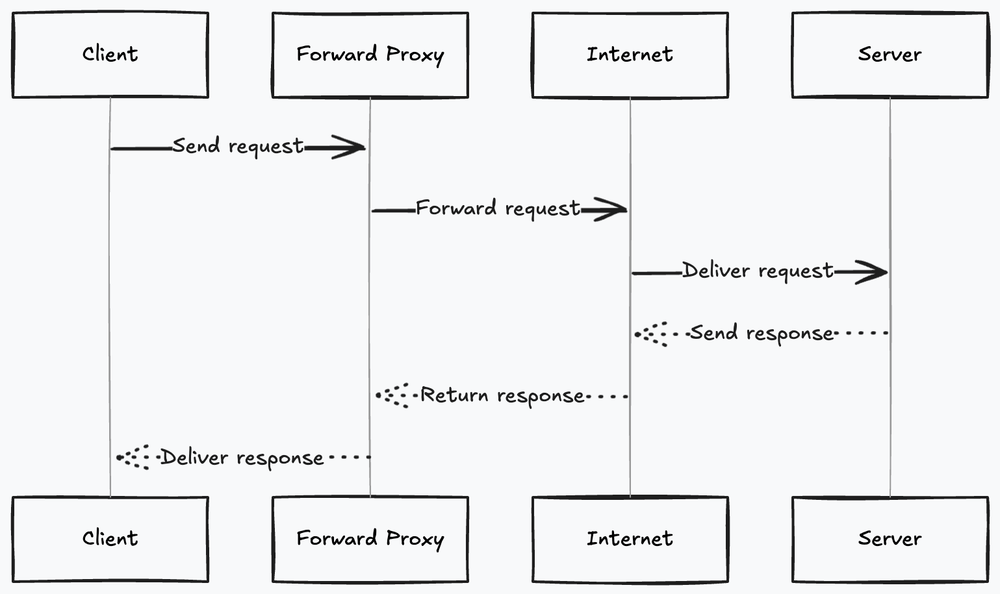

#### AUTH SERVICE

What is the difference btw Authenication and Authorisation?

 - Authorisation --> assigning the functionalities and permissions and capability to different roles of different users. eg: admin in flipkart that have all access [What can you do?]

 - Authenication --> to validate whether you are vaild user or not. [Who are you?]

- What is JWT token?

    - JSON Web Token (JWT) is an open standard (RFC 7519) that defines a compact and self-contained way for securely transmitting information between parties as a JSON object. This information can be verified and trusted because it is digitally signed. JWTs can be signed using a secret (with the HMAC algorithm) or a public/private key pair using RSA or ECDSA.

##### How JWT token works:

    - 

#####  Forward Proxy

    - forward proxy sits btw the client and the internet. 
    - client request a resource from a internet though forward proxy which act as intermediate layer.
    - Why I need forward proxy?
     - Advantages
        - You can do filteration of content like which content do you want to send to the server.
        - Access control - if you dont want to show everything to the client. 
        - Also you can maintain user anominity(don't want to expose the IP address of the user while user makes a req to the internet. then you can implement the machanism to hide that)
        - Also forward proxy will raise a request behave of you. 
     - Disavantages 
        - difficult to implment 
        - if forward proxy fails . it single point of failure.
        - also it also increase the latency as we introduced one more level of layer btw the service.

##### Reverse Proxy

    - Reverse proxy sits btw the internet and the server.
    - the response from server first goes to proxy then goes to client.
    - It helps us to protect the origin  server from direct  access.
    
NOTE: WE CAN SETUP BOTH OR SETUP ANY OF ONE IF YOU ARE OKAY WITH LATENCY.